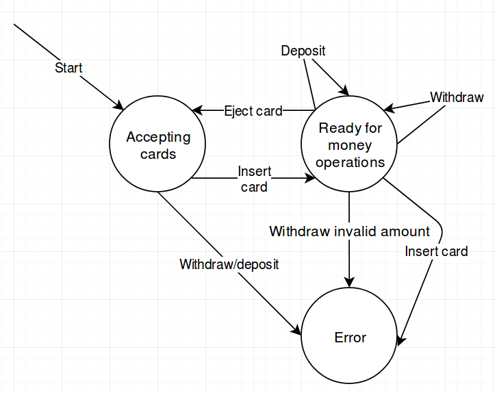

# Links/notes

- [Assignment 4](https://github.com/datsoftlyngby/soft2019spring-test/blob/master/Assignments/04%20Specification%20Based%20Testing%20Techniques%20Assignment.pdf)
- [Relevant slides](https://github.com/datsoftlyngby/soft2019spring-test/blob/master/Slides/04%20Specification%20Based%20Testing%20Techniques%20Slides.pdf)

# Account#getInterest equivalence partitions

| Lower boundary(inclusive) | Upper boundary (exclusive) |
|:-------------------------:|:--------------------------:|
|-∞                         | 0                          | 
| 0                         | 100                        |
| 100                       | 1000                       |
| 1000                      | ∞ + 1                      |

Boundary values are `-1,0`, `99,100`, `999,1000`.

# CreditCard#getDiscount decision table

Each column in the decision table represents a set of inputs to a test, and the expected output(with `-` meaning invalid input). In the tests I chose to separate the tests expecting valid and the ones throwing an exception to keep the test code more readable, although it is not necessary. This table covers all possible inputs. If there were more, testing all of them could become unfeasible. To combat that, a technique "pair-wise" testing could be employed. The idea behind it is _testing all unique pairs of input_. The decision table implies 8 different tests, with pair-wise testing this would go down to 4. Since 8 is not a very large number, and there is no performance or any other impact by testing all combinations, I decided to do so.

| Conditiion                        | Values |
| --------------------------------- |:-:|:-:|:-:|:--:|:--:|:--:|:--:|:-:|
| New customer                      | T | T | T | T  | F  | F  | F  | F |
| Is existing and has loyalty card  | T | T | F | F  | T  | T  | F  | F |
| Is existing and has coupon        | T | F | T | F  | T  | F  | T  | F |
| Discount size                     | - | - | - | 15 | 30 | 10 | 20 | 0 |

# ATM state diagram

Each arrow in the diagram can be translated into a test, where the state it is pointing **from** is the setup of the test, and the state the arrow is pointing **to** is the expected state after the "act" step of the test. All my implemented tests have what is called "0-switch" coverage, meaning I only test individual transitions, for example the transition from "Accepting cards", to "Ready for money operations". 1-switch coverage takes this further and tests pairs of transitions. Testing multiple transitions has the benefit of making sure that one transition does not influence another.

